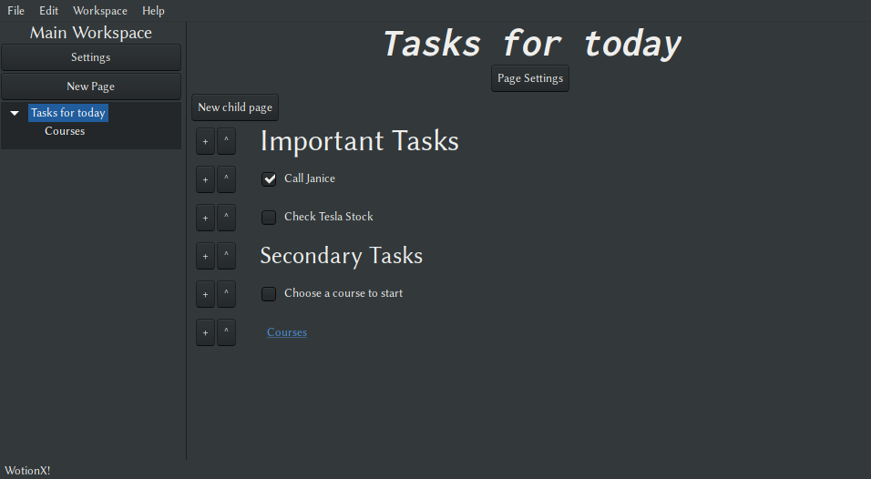

# WotionX
WotionX is a GUI application inspired by Notion. 

Notion is a great piece of software but it is overkill for some of the tasks I use it for in my day to day.

## Motivation for WotionX
- Be able to have as many elements as possible. ( Notion has a cap on a thousand )
- Have a subset of some of the functionalities.
- Learn to develop a GUI program.

Suggestions are welcome.

## Screenshots

